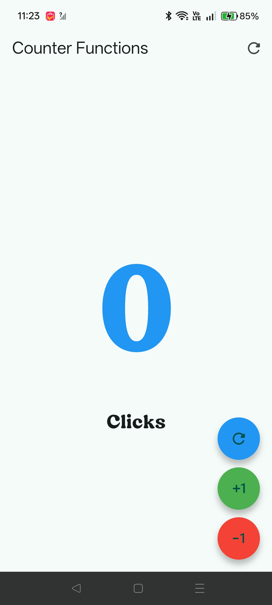
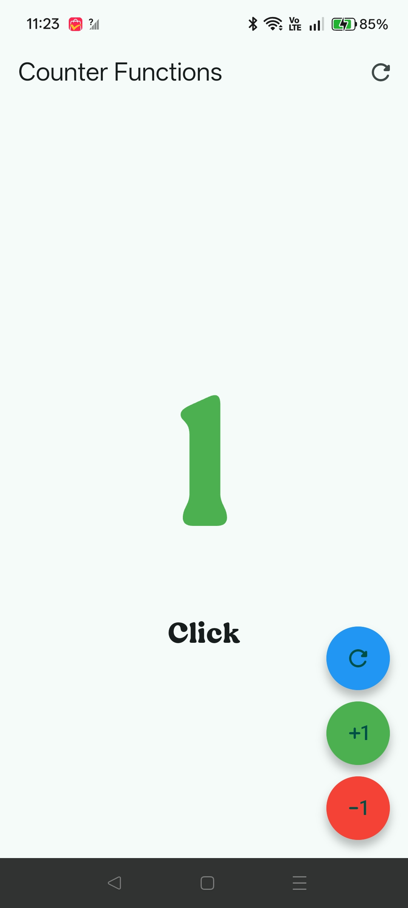
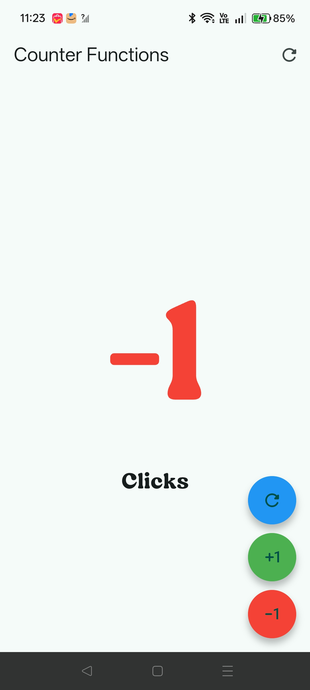
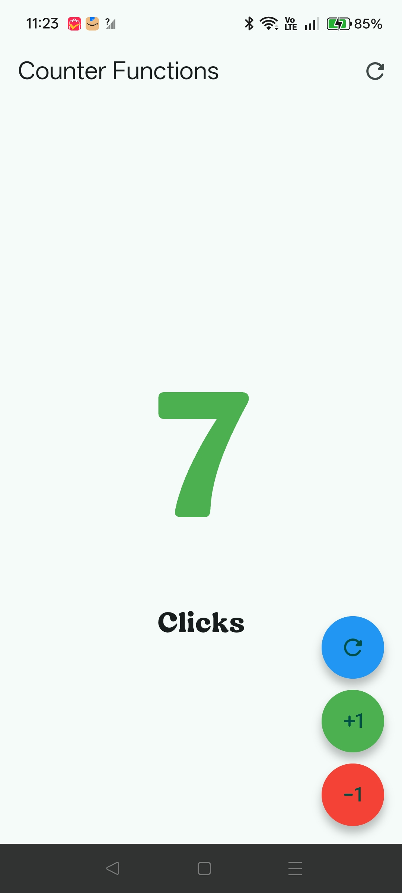

# Práctica No. 2: Mi Primera Aplicación Móvil con Flutter

## Descripción

Se desarrolló una aplicación móvil sencilla con Flutter que muestra un contador interactivo llamado “Counter Functions”. La interfaz presenta un valor numérico grande, un texto descriptivo (“Click” o “Clicks”) y tres botones circulares para reiniciar, sumar y restar.

## Actividades realizadas

- Creación del proyecto móvil con Flutter.
- Implementación de una pantalla con un `StatefulWidget` para manejar el estado del contador.
- Diseño de la interfaz principal con el título “Counter Functions”.
- Agregado de un botón azul para reiniciar el valor a `0`.
- Agregado de un botón verde para incrementar el contador en uno.
- Agregado de un botón rojo para decrementar el contador en uno.
- Cambio de color del número según su valor: azul en cero, verde en positivos y rojo en negativos.
- Ajuste del texto para mostrar “Click” en singular y “Clicks” en plural.
- Aplicación de un estilo visual con botones redondeados y un diseño tipo vista móvil.

## Objetivos

- Conocer la estructura básica de un proyecto Flutter.
- Comprender el uso de widgets con estado.
- Practicar la actualización de la interfaz con `setState`.
- Implementar interacción con eventos de usuario.
- Aprender a modificar estilos y textos según la lógica del contador.

## Resultados

La aplicación funciona como un contador de clics y permite visualizar los siguientes estados:

### Contador en cero

Cuando el valor es `0`, el número aparece en color azul y el texto indica “Clicks”.

  

### Contador en uno

Al presionar el botón de incremento, el contador cambia a `1`, el número se vuelve verde y el texto cambia a “Click”.

  

### Contador en menos uno

Al presionar el botón de decremento, el valor cambia a `-1`, el número se muestra en color rojo y el texto indica “Clicks”.

  

### Contador en siete

Al seguir incrementando, el valor puede llegar a `7`, manteniendo el color verde y el texto en plural.

  

### Reinicio del contador

El botón azul permite devolver el valor a `0` desde cualquier estado.

  

## Liga

[Arquitectura](/Practica_02/hello_world_app/architecture/index.html)
